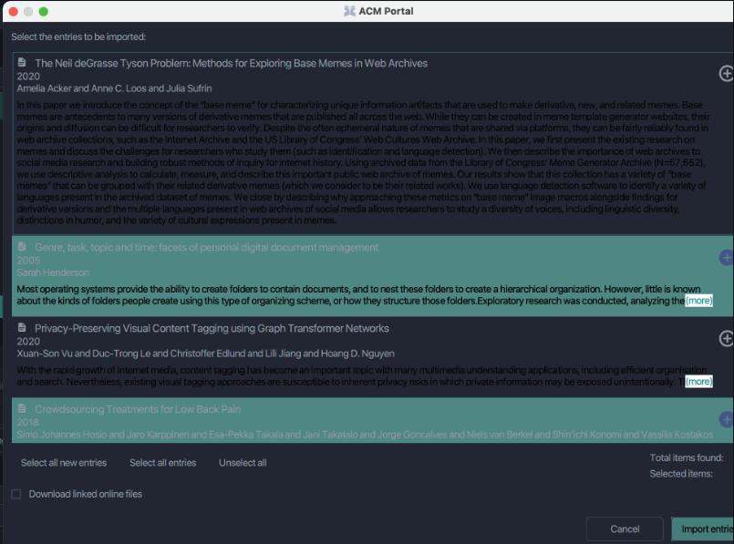

# Arquitetura de Software: JabRef 2022

Neste documento é apresentada uma descrição arquitetônica do sistema de software de código aberto chamado JabRef. Este sistema é responsável por criar uma interface para organização de referências utilizadas no software LaTeX.

### Autores 

- Rafael Rampim Soratto;
- Victor Daniel Pires; 
- Emica.

### Resumo sobre o projeto

O [JabRef](https://github.com/JabRef/jabref) é um sistema multi-plataforma que oferece ferramentas para gerenciar refêrencias em divervos sistemas operacionais: Windows, MacOS e Linux. Esse sistema é implementado em Java e necessita do jdk 18 para ser executado localmente. Todo projeto é bem descrito no [README](https://github.com/JabRef/jabref/blob/main/README.md): as funcionalidades, a instalação, e guia para contribução. 

### Execução do projeto

- Garanta que a versão do jdk da sua máquina é igual ou superior a versão 18.
- Clone o projeto.
- Execute o comando `gradlew run`

### Como contribuir

Existe uma comunidade engajada de contribuidores neste projeto. As contribuições são bem-vindas em diversos níveis do projeto, são eles:

- Contribuições de tradução
- Implementação de funcionalidades e solução de problemas. Para facilitar este processo é fornecido um guia de arquitetura do sistema chamado de [High-level documentation](https://devdocs.jabref.org/getting-into-the-code/high-level-documentation). E também uma diretriz de contribuição.
- Tarefas para iniciantes. existe uma label chamda 'good first issue' para contribuidores recém chegados ao projeto.

Para efetuar uma contruição é utilizado o fluxo padrão em repositórios Github: realizar as alterações em uma ramificação atualizada com a ramificação principal e após finalizar a tarefa deve-se criar um pull request, onde o código inserido será revisado e testado.

## Arquitetura do sistema

### MVC

Na documentação fornecida para os desenvolvedores é dito que a arquitetura 'espaguete' vem sendo migrada com sucesso para a famosa arquitetura MVC (model, view, controller). Portanto, para implementar novas funcionalidades é necessário obedecer a nova arquitetura proposta. Isso é bom pois evidencia quais são as entidades presentes no projecto chamadas de modelos. Definindo as entidades nas quais serão implementadas as funcionalidades, toda a lógica é implementada em uma camada lógica, que é consumida pela interface para apresentar os dados.
A lógica é responsável por ler/escrever/importar/exportar e manipular o modelo, e geralmente é estruturada como uma API que o gui pode chamar e usar. Resumindo: o MVC separa as entidades da regra de negócio e da visualização dos dados. Isto é positivo para identificar em qual camada o dado está, e facilita a manutenção do projeto. São exemplos de modelos do projeto: BibDatases, BibEntries, Events, etc.

Apenas o a camada de interface conhece o usuário e suas preferências e pode interagir com ele para ajudá-lo a resolver tarefas. Para cada camada do MVC, forma-se pacotes de acordo com sua responsabilidade, ou seja, estruturação vertical. O modelo não deve ter dependências com outras classes do JabRef e a lógica deve depender apenas das classes do modelo. O pacote 'cli' agrupa classes que são responsáveis pela interface de linha de comando do JabRef. As preferências representam todas as informações personalizáveis por um usuário para suas necessidades pessoais.

### Dependências permitidas entre camadas

Note que todo o fluxo de depência começa com a interface. A interação com a interface começa todo o fluxo de dependências.

- GUI -> logic -> Model
- GUI -> Model;
- GUI -> Preferences;
- GUI -> CLI
- GUI -> Classes globais

Note também que o modelo é a base da arquitetura, e ela nunca dependerá de outra camada:

- Logic -> Model
- Classes globais -> todo projeto
- cli -> Todo projeto

### Classes importantes

Classes mais importantes e sua relação Ambos GUI e CLI são iniciados através do JabRefMain que por sua vez chamará JabRef que então decide se o GUI (JabRefFrame) ou o CLI (JabRefCLI e muito código no JabRef) serão iniciados. O JabRefFrame representa a janela que contém um SidePane à esquerda usado para os buscadores

### Howtos

O JabRef apresenta um serie de dicas de boa conduta durante o desenvolvimento de novas features para o projeto. Abaixo estão presentes algumas dicas em relação a nomeação de várivaies, criação de testes, tratamento de erro e etc. Caso queira mais imporfmações em relação a isso acesse esse [link](https://devdocs.jabref.org/getting-into-the-code/code-howtos.html).

#### Dicas para código genérico
- Não abreviar nomes váriaveis, classes ou métodos.
- Usar lowerCamelCase no lugar do snake_case.
- Nome de Enuns devem ser escritos no singular. 
  - Ex: Weekday e não Weekdays.

#### Tratamento de erros no JabRef 
- Todas as exceções lançadas devem ser ou estender à `JabRefException`.
- Nunca lançe ou capture `Exception` ou `Throwable`.

#### Gerando erros na interface do usuário
No jabref as mensagens de erro que são mostradas ao usuário, não devem conter técnicos. A ideia é mostrar de forma clara e simples o problema que ococrreu, de forma que não programadores entendem o ocorrido. Para mostrar essas mensagens de erro, duas maneiras diferentes geralmente são usadas. A primeira é mostrando uma caixa de diálogo(`Swing Dialogs`) com o erro e a outra é atualizando a barra de status na parte inferior da janela principal(`status bar`).

#### Manipulação de eventos no JabRef
No jabref o pacote `event` possui alguns eventos especificos que ocorrem. Um exemplo disso é quando ocorre uma nova incersão no banco de dados, então um `EntryAddedEvent` é enviada através do `eventBus` que está presente no `BibDatabase`. Para podermos capturar algum evento no JabRef antes temos que registrar a classe listener com a função `registerListener(Object listener)` presente na `BibDatabase`.

#### Logging
Para o estrutura de logs o JabRef usa o [SLF4J](https://www.slf4j.org/) que é um API de log JAVA que usa o modelo de fachada simples. Todas as mensagem de log são passadas para a [tinylog](https://tinylog.org/v2/), que é responsavel por lidar com qualquer filtragem, formatação e gravação de mesnagem no log. 

#### Adicionando um novo idioma
Esse projeto permite a adição de novas traduções é para tal é deixado um documentação contendo o passo a passo para criação/adição de um novo idioma ao projeto. O modelo organizacion/arquitetural desse projeto, faz com que seja isso seja possivel. Caso querira saber mais sobre como adicionar novas traduções acesse esse [link](https://docs.jabref.org/contributing/how-to-translate-the-ui).

Os passos apresentados são:
- Adicionar o novo idioma ao enum `Language` que está [aqui](https://github.com/JabRef/jabref/blob/master/src/main/java/org/jabref/logic/l10n/Language.java).
- Crie um arquivovazio <código de localidade>.properties.
- Configurar o novo idioma no [Crowdin](https://crowdin.com/project/jabref)

#### Casos de teste
O JabRef apresenta algumas dicas para o processo de criação de testes. Um das dicas é em relação a onde criar esses testes, é aconselhável criar todos os testes dentro da classe `classTest`. Outra dica é em relação a criação dos nomes, e para isso deve-se optar sempre por nomes bem descritivos em realação ao teste em questão. Um exemplo de nome de teste seria o `formatRemovesDoubleBracesAtBeginning`. O ideial é evitar colocar a palavra `test` no nome, pois o nome da classe já deixa isso explícito. Outro ponto a se observar é que os testes devem ser criados para apenas um ação por vez. Ao inves de criar um teste que exculte tudo, crie varios testes para cada funcionalidade separadamente, a ideia é que cada ponto seja testado o melhor possivel. Lembre-se também de testar casos de erro, geralmente costumamos testar apenas casos de sucesso, po´rem o contrario tambem  é muito importante.  Como boa pratica é aconselhável escrever testes antes de começar a desenvolver a funcionalidade. Em caso de correção de bug lembre-se sempre de arrumar o caso de teste.

## JabRef issue:

### ISSUE: Dark Theme : Search -> Import entries dialog text not readable

A Tarefa foi escrita dia 19 de Julho de 2021 e possui um total de 27 comentários no total.
O primeiro comentário refere-se ao passo a passo para encontrar o erro.

> LINK 

- https://github.com/JabRef/jabref/issues/7927

> DESCRIPTION

1 - Have Dark Theme enabled
2 - Search for an entry in the web search
3 - Import entries window opens
4 - See the color of the abstract text is black

> PRINT

> Fluxo de interações anteriores

- Inicialmente o autor da issue @Siedlerchr adicionou a label ui good first issue. E adicionou a prioridade 'Normal' para a issue.
- No mesmo dia k3KAW8Pnf7mkmdSMPHz27 comentou que um bom ponto de começo são os arquivos com o tema default e e darkmode:
    
    - https://github.com/JabRef/jabref/blob/main/src/main/java/org/jabref/gui/Base.css, the default theme, where most of our .css are stored.

    - https://github.com/JabRef/jabref/blob/main/src/main/java/org/jabref/gui/Dark.css, which is where changes most likely should be made.

- No dia 21 de Julho, calvinmorett comentou:
    
    - existe algum processo para que eu possa fazer uma inspeção no navegador desta seção de entrada? Para ver quais variáveis são direcionadas/anexadas aqui do dark.css.

    - A resposta de Siedlerchr foi: Dê uma olhada na ferramenta de visualização sceniv https://github.com/JonathanGiles/scenic-view
    Você basicamente inicia o JabRef, depois a vista panorâmica e pode inspecionar o gui

    - calvinmorett teve alguns problemas com sceninc-view porém outros usuários comentáram que consiguiram utilizar o Scenin View a partir dos projetos Gradle no IntelliJ. Foi recomendado utilizar Intellij no lugar do Eclipse. Ainda sim esse usuário teve grande dificuldade para inspecionar os elementos que causam o erro.

    - Somente dia 23 de Julho de 2021 calvinmorett assume a tarefa para seu nome, com alguns comentários:
        - Embora não seja a abordagem mais rápida decidi adicionar uma nova folha de estilo CSS para inserir no JabRef e passar individualmente por cada variável. Posso então identificar variáveis com nome ambíguo e ver onde as variáveis estão sendo atribuídas na interface do usuário.

        - Encontrei a principal causa do motivo pelo qual os itens de pesquisa no modo escuro são difíceis de ler na variável -fx-light-text-color. Isso causa um problema porque, nos resultados da pesquisa, está sendo usado para itens não selecionados/não ativos, além de ser usado para itens selecionados e ativos.

        - Uma solução -- onde o texto permanece da mesma cor em ambas as instâncias -- poderia ser, para definir o plano de fundo dos itens selecionados e não selecionados, fechar o valor da cor. Algo onde ainda podemos manter um contraste adequado com uma cor de fonte que permanece estática.

        - @Siedlerchr Por favor, atribua-me este problema. E assim foi feito.

    - Porém, o autor da issue ressalta: Acho que precisamos ter uma cor diferente para ativo/inativo que deve ser possível com as pseudo classes active/inactive.

    - calvinmorett tentou mais um pouco e por fim não encontrou o estilo CSS que controla o texto do resumo do resultado. Essa foi sua última interação em 25 de Julho de 2021.

    - No dia 8 de agosto de 2021 k3KAW8Pnf7mkmdSMPHz27 removeu a label de good first issue e colocou alguns links que ajudam a resolver a issue.

    - No dia 22 de setembro de 2021 koppor adicionou a label de good first issue novamente.

> Fluxo de nossas interações na issue 

    - victordmp comentou : 
        - Hi, we are a group of students studying Computer Science at Universidade Tecnologica Federal do Paraná (UTFPR) and we wanted to check if this issue is available for us to work on in our free software discipline task. And if it's available, we'd like to get some valuable input based on previous contributions to this edition.

    - calixtus respondeu: I believe it's free to work on. Last edit on this this issue is almost a year old.

    - ThiloteE respondeu: 
        - Como conselho geral: Confira https://github.com/JabRef/jabref/blob/main/CONTRIBUTING.md para começar. Além disso, https://devdocs.jabref.org/getting-into-the-code/guidelines-for-setting-up-a-local-workspace vale a pena dar uma olhada. Sinta-se à vontade para perguntar se tiver alguma dúvida aqui no GitHub ou também no chat Gitter do JabRef.

    - Tente abrir um pull request (rascunho) desde o início, para que as pessoas possam ver que você está trabalhando no problema e para que possam ver a direção em que o pull request está indo. Dessa forma, você provavelmente receberá um feedback valioso.

    - Com isto criamos o seguinte https://github.com/JabRef/jabref/pull/8929

### PR

- https://github.com/JabRef/jabref/pull/8929

> PR COMMENTS

