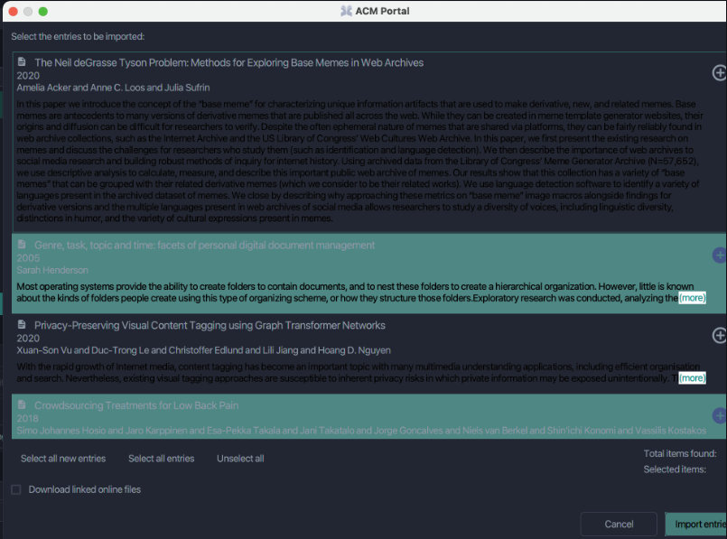

## JabRef issue:

### ISSUE: Dark Theme : Search -> Import entries dialog text not readable

A Tarefa foi escrita dia 19 de Julho de 2021 e possui um total de 27 comentários no total.
O primeiro comentário refere-se ao passo a passo para encontrar o erro.

> LINK 

- https://github.com/JabRef/jabref/issues/7927

> DESCRIPTION

1 - Have Dark Theme enabled
2 - Search for an entry in the web search
3 - Import entries window opens
4 - See the color of the abstract text is black

> PRINT

> Fluxo de interações anteriores

- Inicialmente o autor da issue @Siedlerchr adicionou a label ui good first issue. E adicionou a prioridade 'Normal' para a issue.
- No mesmo dia k3KAW8Pnf7mkmdSMPHz27 comentou que um bom ponto de começo são os arquivos com o tema default e e darkmode:
    
    - https://github.com/JabRef/jabref/blob/main/src/main/java/org/jabref/gui/Base.css, the default theme, where most of our .css are stored.

    - https://github.com/JabRef/jabref/blob/main/src/main/java/org/jabref/gui/Dark.css, which is where changes most likely should be made.

- No dia 21 de Julho, calvinmorett comentou:
    
    - existe algum processo para que eu possa fazer uma inspeção no navegador desta seção de entrada? Para ver quais variáveis são direcionadas/anexadas aqui do dark.css.

    - A resposta de Siedlerchr foi: Dê uma olhada na ferramenta de visualização sceniv https://github.com/JonathanGiles/scenic-view
    Você basicamente inicia o JabRef, depois a vista panorâmica e pode inspecionar o gui

    - calvinmorett teve alguns problemas com sceninc-view porém outros usuários comentáram que consiguiram utilizar o Scenin View a partir dos projetos Gradle no IntelliJ. Foi recomendado utilizar Intellij no lugar do Eclipse. Ainda sim esse usuário teve grande dificuldade para inspecionar os elementos que causam o erro.

    - Somente dia 23 de Julho de 2021 calvinmorett assume a tarefa para seu nome, com alguns comentários:
        - Embora não seja a abordagem mais rápida decidi adicionar uma nova folha de estilo CSS para inserir no JabRef e passar individualmente por cada variável. Posso então identificar variáveis com nome ambíguo e ver onde as variáveis estão sendo atribuídas na interface do usuário.

        - Encontrei a principal causa do motivo pelo qual os itens de pesquisa no modo escuro são difíceis de ler na variável -fx-light-text-color. Isso causa um problema porque, nos resultados da pesquisa, está sendo usado para itens não selecionados/não ativos, além de ser usado para itens selecionados e ativos.

        - Uma solução -- onde o texto permanece da mesma cor em ambas as instâncias -- poderia ser, para definir o plano de fundo dos itens selecionados e não selecionados, fechar o valor da cor. Algo onde ainda podemos manter um contraste adequado com uma cor de fonte que permanece estática.

        - @Siedlerchr Por favor, atribua-me este problema. E assim foi feito.

    - Porém, o autor da issue ressalta: Acho que precisamos ter uma cor diferente para ativo/inativo que deve ser possível com as pseudo classes active/inactive.

    - calvinmorett tentou mais um pouco e por fim não encontrou o estilo CSS que controla o texto do resumo do resultado. Essa foi sua última interação em 25 de Julho de 2021.

    - No dia 8 de agosto de 2021 k3KAW8Pnf7mkmdSMPHz27 removeu a label de good first issue e colocou alguns links que ajudam a resolver a issue.

    - No dia 22 de setembro de 2021 koppor adicionou a label de good first issue novamente.

> Fluxo de nossas interações na issue 

    - victordmp comentou : 
        - Hi, we are a group of students studying Computer Science at Universidade Tecnologica Federal do Paraná (UTFPR) and we wanted to check if this issue is available for us to work on in our free software discipline task. And if it's available, we'd like to get some valuable input based on previous contributions to this edition.

    - calixtus respondeu: I believe it's free to work on. Last edit on this this issue is almost a year old.

    - ThiloteE respondeu: 
        - Como conselho geral: Confira https://github.com/JabRef/jabref/blob/main/CONTRIBUTING.md para começar. Além disso, https://devdocs.jabref.org/getting-into-the-code/guidelines-for-setting-up-a-local-workspace vale a pena dar uma olhada. Sinta-se à vontade para perguntar se tiver alguma dúvida aqui no GitHub ou também no chat Gitter do JabRef.

    - Tente abrir um pull request (rascunho) desde o início, para que as pessoas possam ver que você está trabalhando no problema e para que possam ver a direção em que o pull request está indo. Dessa forma, você provavelmente receberá um feedback valioso.

    - Com isto criamos o seguinte https://github.com/JabRef/jabref/pull/8929

### PR

- https://github.com/JabRef/jabref/pull/8929

> PR COMMENTS
